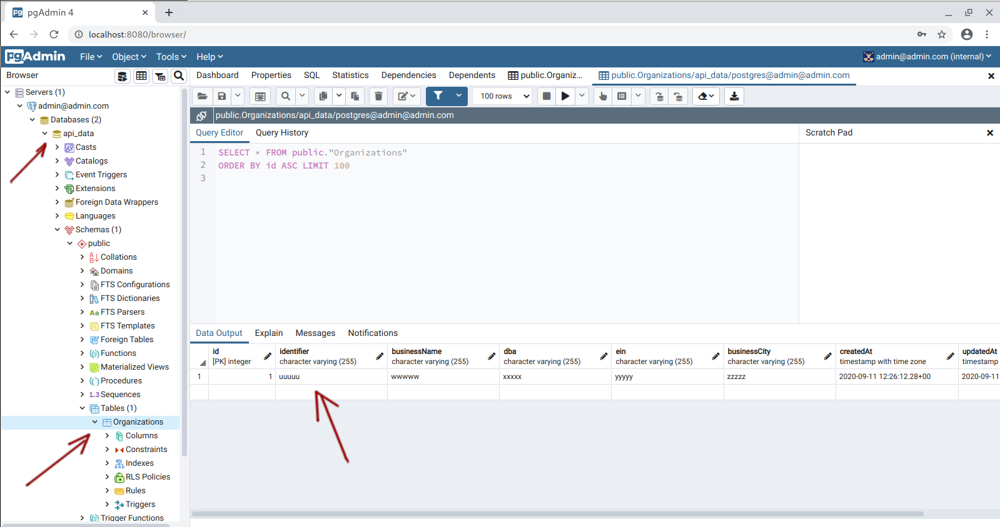

# Node.js + Postgres + Redis queue + Docker Compose

Project to demonstrate running Node.js with Postgres & Redis queue using Docker Compose.

## Run everything

```sh
docker-compose up --build
```

## Test API

The API has a `ping` end-point to check on the server's status:

```sh
echo "$(curl -s http://localhost:3000/ping)"
```

You should see some information:

```
{"environment":"development","postgres_db":"up","pong":"OK","waiting_jobs":0,"active_jobs":0,"completed_jobs":2,"failed_jobs":0,"delayed_jobs":0}
```

You can also run a test script to demonstrate how `POST` end-point is working:

```sh
./api_test.sh
```

You should see the following:

```
API call #1. Don't process data:
{"data":{"organization":{"identifier":"aaaaa","businessName":"bbbbb","dba":"cccc","ein":"dddd","businessCity":"eeee"}}}

API call #2. Process data, with incorrect data passed:
{"error":"Organization validation failed."}

API call #3. Process correct data:
{"data":{"organization":{"identifier":"aaaaa","businessName":"bbbbb","dba":"cccc","ein":"dddd","businessCity":"eeee"}},"result":{"status":"PROCESSED","createdAt":"2020-09-11T12:40:48+00:00"}}
```

## Debug Node.js code

Open Chrome Developer Tools, go to Node.js debugging panel, and open `http://localhost:9229` to debug API Node.js process. Open `http://localhost:9230` for debugging worker Node.js process.

## Explore Postgres DB via PGAdmin

This projects also bundles PGAdmin. You can reach it at `http://localhost:8080/`. Use the following credentials to log in:

```
EMAIL=admin@admin.com
PASSWORD=postgres
```

Then setup a new server (`Host name` is `postgres`, `Username` is `postgres`, `Password` is `postgres`). You should be able to see something like this:


